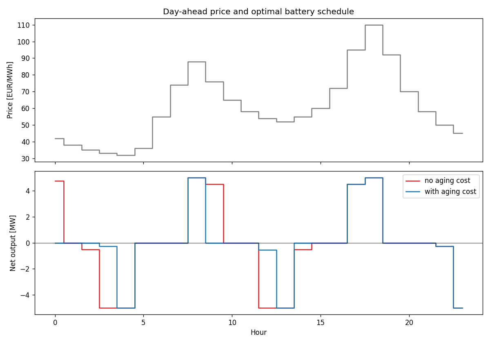

# Battery dispatch with cycle aging cost (Pyomo)

LP scheduling a 10 MWh / 5 MW battery over 24h day-ahead prices, with
degradation as a cost term. Inspired by the CDSF in TU Graz's
[LEGO model](https://github.com/IEE-TUGraz/LEGO).

| Scenario             | Profit (EUR/day) | Discharged (MWh) |
|----------------------|------------------|------------------|
| No degradation cost  | 818              | 23.8             |
| With degradation cost| 431              | 14.5             |



## Run

```bash
pip install pyomo highspy matplotlib
python battery_dispatch.py
```
